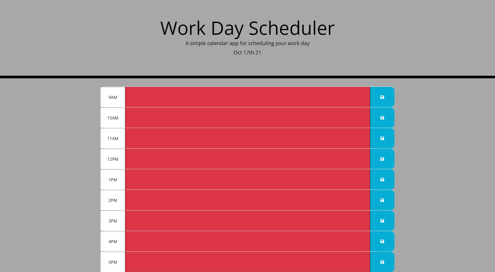

# Work Day Scheduler

## Purpose

    -This is a work day scheduler! It let's you keep track of your tasks throughout a standard business timeframe.
    -Keeping track of your daily 9 - 5 tasks are made easier with this project.

## Website
[Wen Link](https://nkepers.github.io/My-Scheduler/ "My Scheduler")

## Display

    -This is how the page will look when opened. Note the colors will vary based on time of day.

## Credit
This couldn't have been accomplished without their help!
[University of Arizona Coding Bootcamp](https://courses.bootcamp.com "UofA")
[W3Schools](https://www.w3schools.com/ "W3Schools")
[MDN Web Docs](https://developer.mozilla.org/en-US/ "MDN Web Docs")
[Youtube](https://youtube.com/ "Youtube")